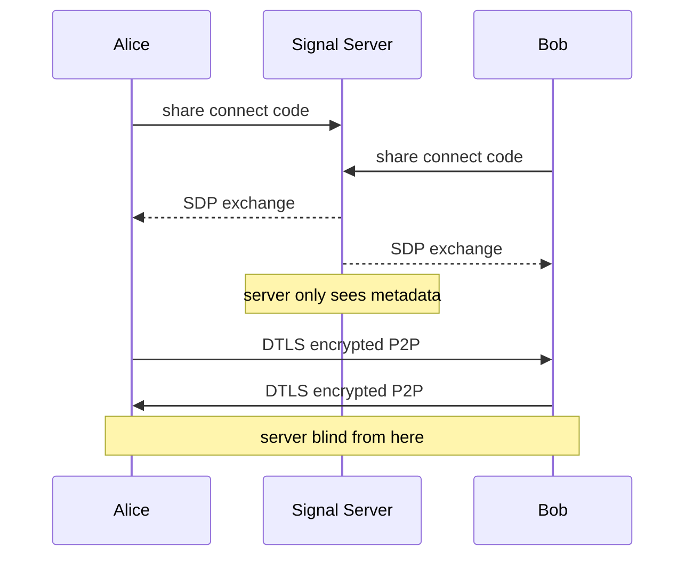

# tomsg

一款极简的点对点加密聊天应用。消息通过 WebRTC DTLS 协议进行端到端加密 —— 服务器全程无法查看你的聊天内容。
## How it works



1. 双方打开应用，各自获取一组 6 位连接码
2. 通过任意渠道将你的连接码发给对方
3. 输入对方的连接码并建立连接 —— 即创建基于 DTLS 加密的 WebRTC 数据通道
4. 核对聊天顶部显示的安全码，确保双方一致，防止中间人攻击
5. 开始聊天 —— 消息全程不经过任何服务器

## Features

- 🔒 基于 WebRTC DTLS 实现端到端加密
- 🔑 安全码校验，防范中间人攻击
- ⚡ 纯点对点传输 —— 无消息存储、无服务器中转
- 🌓 深色 / 浅色模式
- 📱 响应式布局，适配多设备

## Getting started

```bash
# install dependencies
npm install

# start dev server
npm run dev

# build for production
npm run build
```

## Security notes

| 风险类型 | 防护状态 | 说明 |
|---|---|---|
| 消息拦截 | ✅ 已防护 | DTLS 协议对所有数据通道（DataChannel）传输内容进行加密 |
| 信号服务器中间人攻击 | ⚠️ 需手动核验 | 建立连接后，需核对安全码，排除中间人攻击风险 |
| IP 地址暴露 | ⚠️ WebRTC 固有特性 | 若需保护 IP 隐私，建议搭配 VPN 使用 |
| 跨站脚本攻击（XSS） | ✅ 已防护 | Vue 使用简单模板插值，未使用 HTML解析 |

信令服务器（0.peerjs.com）仅用于交换建立对等连接所需的连接元数据（SDP 协议描述 + ICE 候选地址），无法读取消息内容。若追求最高级别的信任度，建议自行部署信令服务器：

```bash
npx peerjs --port 9000
```

随后在 initPeer() 函数中，将客户端的信令服务器指向你自行部署的服务器即可。

## Disclaimer

本项目仅供学习和技术研究使用，不得用于任何违法犯罪活动。使用者应遵守所在国家和地区的相关法律法规。项目作者不承担因使用本软件而产生的任何法律责任。请在合法合规的前提下使用本项目。

## License

本项目基于 [MIT](LICENSE) 许可证开源。
