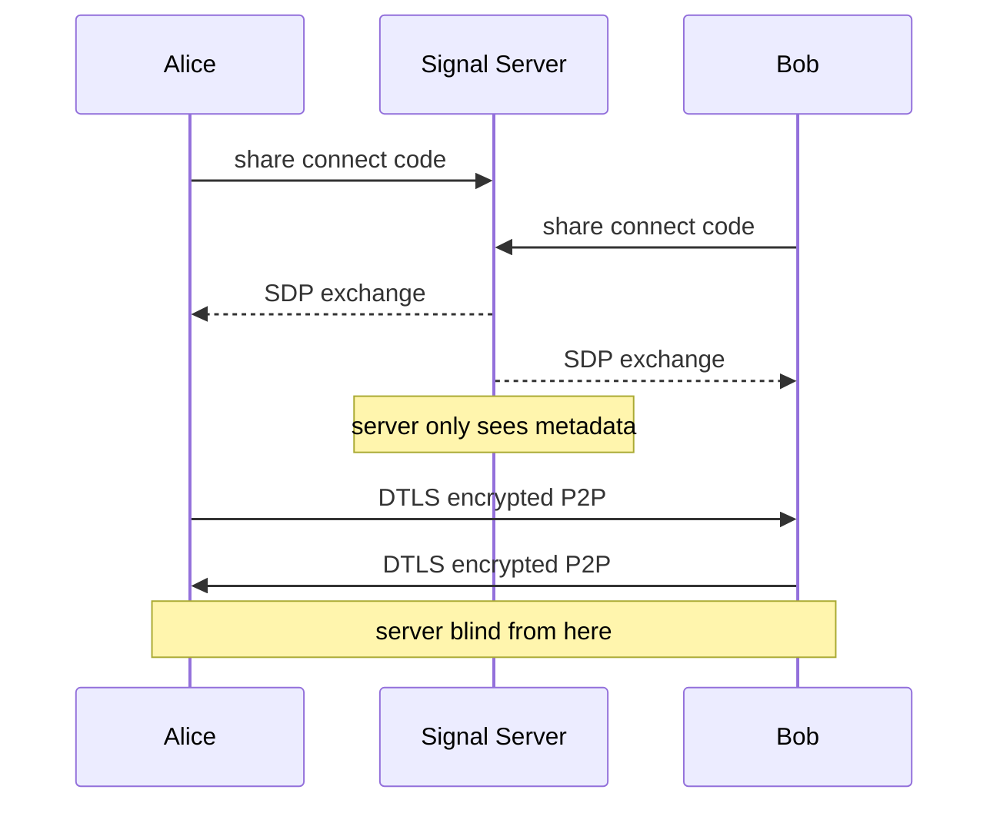

# tomsg

A minimalist P2P encrypted chat app. Messages are end-to-end encrypted via WebRTC DTLS — no server ever sees your content.

## How it works



1. Both parties open the app and get a 6-character connection code
2. Share your code with the other person (via any channel)
3. Enter their code and connect — a DTLS-encrypted WebRTC DataChannel is established
4. Verify the **safety code** shown in the chat header matches on both sides to rule out MITM attacks
5. Chat — messages never touch a server

## Features

- 🔒 End-to-end encryption via WebRTC DTLS
- 🔑 Safety code verification to prevent MITM attacks
- ⚡ True P2P — no message storage, no server relay
- 🌓 Dark / light mode
- 📱 Responsive layout

## Getting started

```bash
# install dependencies
npm install

# start dev server
npm run dev

# build for production
npm run build
```

## Security notes

| Threat | Status | Notes |
|---|---|---|
| Message interception | ✅ Mitigated | DTLS encrypts all DataChannel traffic |
| MITM via signal server | ⚠️ Manual check | Compare safety codes out-of-band after connecting |
| IP exposure | ⚠️ Inherent to WebRTC | Use a VPN if IP privacy matters |
| XSS | ✅ Mitigated | Vue template interpolation auto-escapes all output |

The signaling server (`0.peerjs.com`) only exchanges connection metadata (SDP + ICE candidates) to establish the peer connection. It cannot read messages. For maximum trust, self-host the signaling server:

```bash
npx peerjs --port 9000
```

Then point the client at your own server in `initPeer()`.

## License

MIT
This project is licensed under the [MIT](LICENSE).
